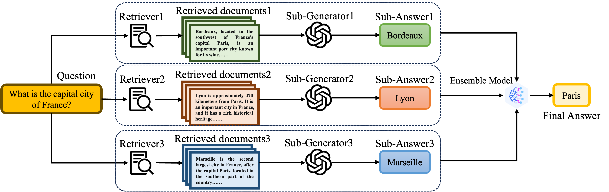

# <div align="center">RAG-Blender: Retrieval-Augmented Generation Ensemble<div>

RAG-Blender is a framework that studies the  of information from different RAG systems to complete question-answering tasks. This framework uses multiple individual generators with different external knowledge as source RAG systems. For each RAG system, a simple RAG process is first executed to obtain external knowledge and responses for the same query. Then, all the information is carefully integrated and input into the final model, with experiments conducted under both untrained and trained settings. 

<p align="center">

</p>

Experimental results on four widely used question-answering benchmarks show that, compared to traditional RAG systems, RAG-Blender achieves superior performance. Additional experiments demonstrate that the RAG-Blender framework has excellent generalization and information fusion capabilities. Further experimental analysis provides valuable guidance for the application of model ensembles in RAG systems.

## :link: Navigation
- [Contributions](#sparkles-contribution)
- [Main Results](#mag_right-main-results)
- [Installation](#wrench-installation)
- [Quick Start](#rocket-quick-start)

## :sparkles: Contribution
Our contributions are listed as follows:
- **A Comprehensive Study**: We investigate a systematic study of RAG-Blender framework, marking the first comprehensive study of the model's capability to perform meta-inference by integrating information flow from multiple RAG systems.

- **A Mathematical Model**: We first establish a mathematical model of the RAG-Blender process from an information theory perspective, preliminarily demonstrating that  RAG-Blender can effectively alleviate the uncertainty in the generation of answers.

- **A Good Performance**: We validate the effectiveness of RAG-Blender in both "Standard" and "Self-Alignment" ensemble settings across four widely used QA benchmarks, demonstrating the significant advantages of RAG-Blender over vanilla RAG and strong baselines.

- **Full Utilization Of Diverse Information**: The experiments show that the RAG-Blender framework exhibits strong performance compared to the self-consistency method. It can fully leverage the diversity of different systems to generate answers.

- **More Desirable Properties**: Detailed quantitative analyses reveal that fine-tuned small LLMs can achieve ensemble performance comparable to that of fine-tuned large LLMs. Moreover, the ensemble paradigm demonstrates strong generalization and scalability, providing a solid foundation for exploring model ensemble in RAG scenarios in future work.

## :mag_right: Main Results

We conducted a total of eight experiments. Due to space limitations, we only present the results of the main experiments here. We compared the RAG-Blender method with the standard RAG method, <a href="https://aclanthology.org/2023.emnlp-main.495.pdf">FLARE</a>, <a href="https://aclanthology.org/2023.findings-emnlp.691.pdf">SKR</a>, and <a href="https://arxiv.org/pdf/2203.11171">Self-consistency</a>. The results show that our RAG-Blender framework always achieves the best performance.

<table>
  <thead>
    <tr>
      <th rowspan="2">Method</th>
      <th rowspan="2">Backbone</th>
      <th colspan="2">NQ</th>
      <th colspan="2">HotpotQA</th>
      <th colspan="2">2Wiki</th>
      <th colspan="2">TriviaQA</th>
      <th colspan="2">Avg.</th>
    </tr>
    <tr>
      <th>EM</th>
      <th>F1</th>
      <th>EM</th>
      <th>F1</th>
      <th>EM</th>
      <th>F1</th>
      <th>EM</th>
      <th>F1</th>
      <th>EM</th>
      <th>F1</th>
    </tr>
  </thead>
  <tbody>
    <tr>
      <td>Standard RAG (S1)</td>
      <td>Llama2-7B</td>
      <td>15.65</td>
      <td>30.58</td>
      <td>11.61</td>
      <td>26.97</td>
      <td>11.76</td>
      <td>26.03</td>
      <td>31.22</td>
      <td>53.00</td>
      <td>17.56</td>
      <td>34.32</td>
    </tr>
    <tr>
      <td>Standard RAG (S2)</td>
      <td>GLM-4-9B</td>
      <td>38.45</td>
      <td>49.55</td>
      <td>29.33</td>
      <td>39.57</td>
      <td>26.96</td>
      <td>33.57</td>
      <td>57.12</td>
      <td>67.21</td>
      <td>37.97</td>
      <td>47.51</td>
    </tr>
    <tr>
      <td>Standard RAG (S3)</td>
      <td>Mistral-7B</td>
      <td>27.20</td>
      <td>41.59</td>
      <td>22.74</td>
      <td>35.19</td>
      <td>9.05</td>
      <td>22.64</td>
      <td>53.90</td>
      <td>65.76</td>
      <td>28.22</td>
      <td>41.30</td>
    </tr>
    <tr>
      <td>Standard RAG</td>
      <td>Qwen2.5-7B</td>
      <td>37.45</td>
      <td>47.94</td>
      <td>31.01</td>
      <td>41.01</td>
      <td>25.75</td>
      <td>32.07</td>
      <td>60.39</td>
      <td>69.38</td>
      <td>38.65</td>
      <td>47.60</td>
    </tr>
    <tr>
      <td>FLARE</td>
      <td>Qwen2.5-7B</td>
      <td>13.55</td>
      <td>22.34</td>
      <td>18.74</td>
      <td>26.47</td>
      <td>24.55</td>
      <td>29.26</td>
      <td>41.99</td>
      <td>49.64</td>
      <td>24.71</td>
      <td>31.93</td>
    </tr>
    <tr>
      <td>SKR</td>
      <td>Qwen2.5-7B</td>
      <td>31.61</td>
      <td>42.51</td>
      <td>28.33</td>
      <td>38.01</td>
      <td>25.35</td>
      <td>31.62</td>
      <td>56.40</td>
      <td>64.99</td>
      <td>35.42</td>
      <td>44.28</td>
    </tr>
    <tr>
      <td>Self-consistency</td>
      <td>Qwen2.5-7B</td>
      <td>36.40</td>
      <td>46.88</td>
      <td>31.11</td>
      <td>41.17</td>
      <td>25.72</td>
      <td>32.06</td>
      <td>60.50</td>
      <td>69.48</td>
      <td>38.43</td>
      <td>47.40</td>
    </tr>
    <tr>
      <td>Standard RAG+FT</td>
      <td>Qwen2.5-7B</td>
      <td><u>45.87</u></td>
      <td><u>54.89</u></td>
      <td><u>36.11</u></td>
      <td><u>48.24</u></td>
      <td><u>33.21</u></td>
      <td><u>39.26</u></td>
      <td><u>60.81</u></td>
      <td><u>72.27</u></td>
      <td><u>44.00</u></td>
      <td><u>53.76</u></td>
    </tr>
    <tr>
      <td>RAG-Blender with S1, S2, and S3</td>
      <td>Qwen2.5-7B</td>
      <td>38.70</td>
      <td>50.53</td>
      <td>32.71</td>
      <td>44.22</td>
      <td>27.36</td>
      <td>34.34</td>
      <td>61.58</td>
      <td>71.28</td>
      <td>40.09</td>
      <td>50.09</td>
    </tr>
    <tr>
      <td>RAG-Blender+FT</td>
      <td>Qwen2.5-7B</td>
      <td><strong>47.70</strong></td>
      <td><strong>56.53</strong></td>
      <td><strong>37.96</strong></td>
      <td><strong>49.61</strong></td>
      <td><strong>34.41</strong></td>
      <td><strong>40.46</strong></td>
      <td><strong>62.71</strong></td>
      <td><strong>73.57</strong></td>
      <td><strong>45.70</strong></td>
      <td><strong>55.04</strong></td>
    </tr>
  </tbody>
</table>

## :wrench: Installation

To get started with RAG-Blender, you can clone it from Github and install (requires Python 3.9+). If you want to use vllm and sentence-transformers, you can install the optional dependencies:

```bash
# Install vllm for faster speed
pip install vllm>=0.4.1

# Install sentence-transformers
pip install sentence-transformers
```

During retrieval, the faiss toolkit is required. Our experiment uses the faiss-gpu version (the cpu version can also be used).

```bash
# CPU-only version
conda install -c pytorch faiss-cpu=1.8.0

# GPU(+CPU) version
conda install -c pytorch -c nvidia faiss-gpu=1.8.0
```

<!-- Note: It is impossible to install the latest version of `faiss` on certain systems.

From the official Faiss repository ([source](https://github.com/facebookresearch/faiss/blob/main/INSTALL.md)):

> - The CPU-only faiss-cpu conda package is currently available on Linux (x86_64 and arm64), OSX (arm64 only), and Windows (x86_64)
> - faiss-gpu, containing both CPU and GPU indices, is available on Linux (x86_64 only) for CUDA 11.4 and 12.1 -->

## :rocket: Quick Start

We conducted a total of eight experiments and a model-training experiment, the specific contents of which are as follows:
<!-- omit in toc -->
### :link: Navigation
- [Main Experiment for RAG-Blender](#main-experiment-for-rag-blender)
- [the Power of Responses](#the-power-of-responses)
- [Experiment of Information Entropy](#experiment-of-information-entropy)
- [the Power of Ensemble Model](#the-power-of-ensemble-model)
- [the Power of CoT](#the-power-of-cot)
- [the Impact of System Number](#the-impact-of-system-number)
- [the Generalizability of RAG-Blender](#the-generalizability-of-rag-blender)
- [Model Train](#model-train)

### Main Experiment for RAG-Blender
Before running the  experiments, it is necessary to obtain the results of the individual RAG systems, so the standard RAG experiment needs to be run. Under the RAG-Blender folder, run the run.py file. The second line of code below is used to test the metrics of the running results.

```bash
CUDA_VISIBLE_DEVICES=4 python run.py --RAG_type naive --dataset_name nq --temperature 0 --top_p 0.8 --gpu_memory_utilization 0.4 --model_name qwen2.5-7b-instruct
# python evaluate.py --eval_type naive --dataset_name nq --model_name qwen2.5-7b-instruct 
```

Then, run the main experiment. Note that you need to modify the path for the program to read the standard RAG results in pipeline.py to the path where you just saved the results.

```bash
CUDA_VISIBLE_DEVICES=4 python run.py --RAG_type meta --dataset_name nq --temperature 0 --top_p 0.8 --gpu_memory_utilization 0.4 --model_name qwen2.5-7b-instruct --system_prompt 0
```

* ```--RAG_type```: This parameter is used to determine the type of experiment (standard RAG or RAG-Blender).

* ```--system_prompt```: This parameter is used to determine the type of system prompt. Setting it to 0 indicates the use of the simplest prompt for question-answering tasks.

### the Power of Responses

This experiment is used to investigate the importance of individual results. We found that when the external knowledge of each subsystem is fixed to be the same, and different answers are obtained using different generators and then aggregated, the results are still better than directly performing standard RAG.

<table style="width: 100%; border-collapse: collapse;">
  <thead>
    <tr>
      <th style="text-align: left; padding: 8px;">Method</th>
      <th style="text-align: center; padding: 8px;">NQ</th>
      <th style="text-align: center; padding: 8px;">HotpotQA</th>
      <th style="text-align: center; padding: 8px;">2Wiki</th>
      <th style="text-align: center; padding: 8px;">TriviaQA</th>
      <th style="text-align: center; padding: 8px;">Avg.</th>
    </tr>
  </thead>
  <tbody>
    <tr>
      <td style="text-align: left; padding: 8px;">Standard RAG</td>
      <td style="text-align: center; padding: 8px;">47.94</td>
      <td style="text-align: center; padding: 8px;">41.01</td>
      <td style="text-align: center; padding: 8px;">32.07</td>
      <td style="text-align: center; padding: 8px;">69.38</td>
      <td style="text-align: center; padding: 8px;">47.60</td>
    </tr>
    <tr>
      <td style="text-align: left; padding: 8px;">RAG-Blender</td>
      <td style="text-align: center; padding: 8px;"><strong>50.53</strong></td>
      <td style="text-align: center; padding: 8px;"><strong>44.22</strong></td>
      <td style="text-align: center; padding: 8px;"><strong>34.34</strong></td>
      <td style="text-align: center; padding: 8px;"><strong>71.28</strong></td>
      <td style="text-align: center; padding: 8px;"><strong>50.09</strong></td>
    </tr>
    <tr>
      <td style="text-align: left; padding: 8px;">+ Same info</td>
      <td style="text-align: center; padding: 8px;"><u>49.21</u></td>
      <td style="text-align: center; padding: 8px;"><u>42.89</u></td>
      <td style="text-align: center; padding: 8px;"><u>34.03</u></td>
      <td style="text-align: center; padding: 8px;"><u>70.13</u></td>
      <td style="text-align: center; padding: 8px;"><u>49.07</u></td>
    </tr>
  </tbody>
</table>

```bash
CUDA_VISIBLE_DEVICES=4 python run.py --RAG_type SAE --dataset_name nq --temperature 0 --top_p 0.8 --gpu_memory_utilization 0.4 --model_name qwen2.5-7b-instruct --system_prompt 0
```

### Experiment of Information Entropy

In this experiment, we investigate whether the RAG-Blender framework can truly reduce the information entropy of generated answers.

The first experiment is used to calculate the information entropy of the model's output answers.

```bash
CUDA_VISIBLE_DEVICES=4 python run.py --RAG_type meta_logit --dataset_name nq --temperature 0 --top_p 0.8 --gpu_memory_utilization 0.4 --model_name qwen2.5-7b-instruct --system_prompt 0
```
The second experiment is used to calculate the information entropy of the model's output golden answers.
```bash
CUDA_VISIBLE_DEVICES=4 python run.py --RAG_type meta_logit_golden --dataset_name nq --temperature 0 --top_p 0.8 --gpu_memory_utilization 0.4 --model_name qwen2.5-7b-instruct --system_prompt 0
```
Note that this part of the experiment requires the model to be deployed on the GPU using vllm in advance, and then called in the form of an API.
### the Power of Ensemble Model
In this part of the experiment, we attempt to change the size of the  model and repeat the experiment. We used the 0.5B, 1.5B, 3B, 7B, and 14B dialogue models from the Qwen2.5 series, as well as the 1B and 3B dialogue models from the Llama3.2 series and the 8B dialogue model from the Llama3.1 series.
### the Power of CoT
In this part of the experiment, we attempt to investigate the impact of <a href="https://arxiv.org/pdf/2201.11903">CoT</a> on RAG-Blender. We restricted the model's output format in the prompt to:
```jsonl
{"reason": <reason>, "answer": <answer>}
```
```bash
CUDA_VISIBLE_DEVICES=4 python run.py --RAG_type meta --dataset_name nq --temperature 0 --top_p 0.8 --gpu_memory_utilization 0.4 --model_name qwen2.5-7b-instruct --system_prompt 0 --exp_type cot
```
### the Impact of System Number
In this part of the experiment, we investigated the impact of the number of subsystems on the final performance. We increased the number of subsystems from 1 to 6 and repeated the experiments. To fully investigate the impact of the order of the subsystem information, we arranged them from best to worst and from worst to best based on the performance of each subsystem when doing standard RAG individually, and conducted two sets of experiments respectively.
```bash
CUDA_VISIBLE_DEVICES=4 python run.py --RAG_type best2worst --dataset_name nq --temperature 0 --top_p 0.8 --gpu_memory_utilization 0.4 --model_name qwen2.5-7b-instruct --system_prompt 0 
```
```bash
CUDA_VISIBLE_DEVICES=4 python run.py --RAG_type worst2best --dataset_name nq --temperature 0 --top_p 0.8 --gpu_memory_utilization 0.4 --model_name qwen2.5-7b-instruct --system_prompt 0 
```
### the Generalizability of RAG-Blender
In this part of the experiment, we investigated the generalization ability of the RAG-Blender system. First, the  model was trained on the original four datasets using the information from the original three subsystems. Then, the trained model was tested on two new datasets. Additionally, keeping the datasets unchanged but replacing the external knowledge and generators of the subsystems, we conducted the experiments again.
### the Efficiency of RAG-Blender
In this part of the experiment, we investigated the efficiency of the RAG-Blender framework. We conducted comparative experiments for self-consistency@3, @5, and @7, and compared the results with those of RAG-Blender. 

<table style="width: 100%; border-collapse: collapse;">
  <thead>
    <tr>
      <th style="text-align: left; padding: 8px;">Method</th>
      <th style="text-align: center; padding: 8px;">NQ</th>
      <th style="text-align: center; padding: 8px;">HotpotQA</th>
      <th style="text-align: center; padding: 8px;">2Wiki</th>
      <th style="text-align: center; padding: 8px;">TriviaQA</th>
      <th style="text-align: center; padding: 8px;">Avg.</th>
    </tr>
  </thead>
  <tbody>
    <tr>
      <td style="text-align: left; padding: 8px;">SC@3</td>
      <td style="text-align: center; padding: 8px;">46.88</td>
      <td style="text-align: center; padding: 8px;">41.17</td>
      <td style="text-align: center; padding: 8px;">32.06</td>
      <td style="text-align: center; padding: 8px;">69.48</td>
      <td style="text-align: center; padding: 8px;">47.40</td>
    </tr>
    <tr>
      <td style="text-align: left; padding: 8px;">SC@5</td>
      <td style="text-align: center; padding: 8px;">47.39</td>
      <td style="text-align: center; padding: 8px;">41.33</td>
      <td style="text-align: center; padding: 8px;">32.35</td>
      <td style="text-align: center; padding: 8px;">69.45</td>
      <td style="text-align: center; padding: 8px;">47.63</td>
    </tr>
    <tr>
      <td style="text-align: left; padding: 8px;">SC@7</td>
      <td style="text-align: center; padding: 8px;"><u>47.58</u></td>
      <td style="text-align: center; padding: 8px;"><u>41.36</u></td>
      <td style="text-align: center; padding: 8px;"><u>32.39</u></td>
      <td style="text-align: center; padding: 8px;"><u>69.57</u></td>
      <td style="text-align: center; padding: 8px;"><u>47.73</u></td>
    </tr>
    <tr>
      <td style="text-align: left; padding: 8px;">RAG-Blender</td>
      <td style="text-align: center; padding: 8px;"><strong>50.53</strong></td>
      <td style="text-align: center; padding: 8px;"><strong>44.22</strong></td>
      <td style="text-align: center; padding: 8px;"><strong>34.34</strong></td>
      <td style="text-align: center; padding: 8px;"><strong>71.28</strong></td>
      <td style="text-align: center; padding: 8px;"><strong>50.09</strong></td>
    </tr>
  </tbody>
</table>

Even with multiple samplings, self-consistency does not perform as well as RAG-Blender, which only performs four inferences in total.

```bash
CUDA_VISIBLE_DEVICES=4 python run.py --RAG_type sc --dataset_name nq --temperature 0 --top_p 0.8 --gpu_memory_utilization 0.4 --model_name qwen2.5-7b-instruct --system_prompt 0 
```
### Model Train
In this section, we conducted training on the model for standard RAG tasks, RAG-Blender, and CoT.
#### Train on Standard RAG Task
For this part of the training, we randomly and uniformly sampled from the training sets of the four datasets, obtaining a total of 10,000 training data points. We then performed <a href="https://arxiv.org/pdf/2106.09685">Lora</a> Finetune on the original aggregation model.
```bash
export LD_LIBRARY_PATH=/usr/local/cuda-11.8/lib64:$LD_LIBRARY_PATH
export CUDA_VISIBLE_DEVICES=7
accelerate launch --config_file /your_path/MetaRAG/scripts/train/zero1_gpu.yml --main_process_port=1152 /your_path/MetaRAG/scripts/train/finetune_lora.py \
  --model_path /your_path/LLM-Research/Llama-3___2-1B-Instruct/ \
  --output_path /your_path/models/lora/ \
  --tokenizer_path /your_path/LLM-Research/Llama-3___2-1B-Instruct/ \
  --dataset /your_path/datas.jsonl \
  --max_length 1600 \
  --rag_type naive \
  --per_device_train_batch_size 2 \
  --epoch 3 \
```
#### Train on RAG Blender Task
For this part of the training, we first extracted a total of 10,000 data points from the training sets of the four datasets. We then performed the standard RAG process using three selected generators to obtain the sub-answers and external knowledge for each question. Subsequently, similar to the inference process of RAG-Blender, we embedded all the information into a pre-written prompt and conducted Lora Finetune.
```bash
export LD_LIBRARY_PATH=/usr/local/cuda-11.8/lib64:$LD_LIBRARY_PATH
export CUDA_VISIBLE_DEVICES=7
accelerate launch --config_file /your_path/MetaRAG/scripts/train/zero1_gpu.yml --main_process_port=1152 /your_path/MetaRAG/scripts/train/finetune_lora.py \
  --model_path /your_path/LLM-Research/Llama-3___2-1B-Instruct/ \
  --output_path /your_path/models/lora/ \
  --tokenizer_path /your_path/LLM-Research/Llama-3___2-1B-Instruct/ \
  --dataset /your_path/datas.jsonl \
  --max_length 5000 \
  --rag_type meta \
  --per_device_train_batch_size 2 \
  --epoch 3 \
```
#### Train on CoT Distillation
For this part of the training, we first extracted a total of 60,000 data points from the training sets of the four datasets. We then used the Qwen2.5-72b-instruct model, guiding it to output the reason and answer for each training data point in the specified format using the CoT method. After that, we filtered out the training data that did not meet the format requirements and further selected 10,000 data points to form the final training dataset.